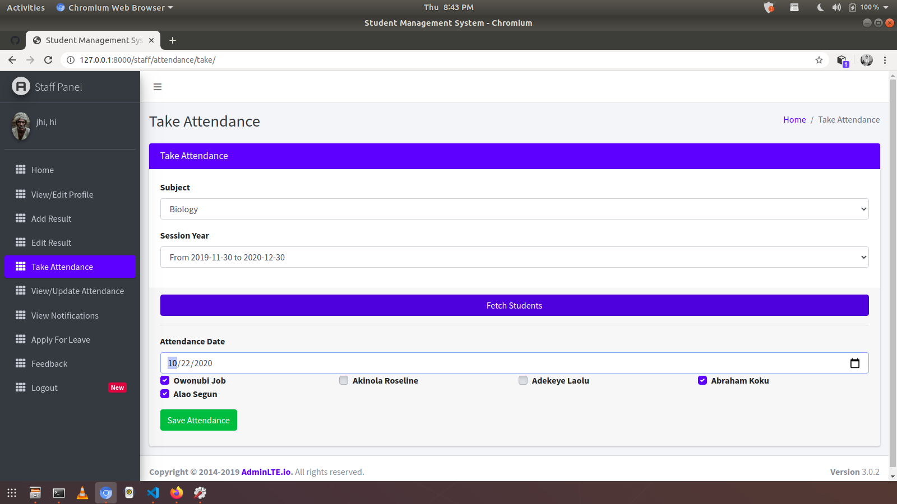
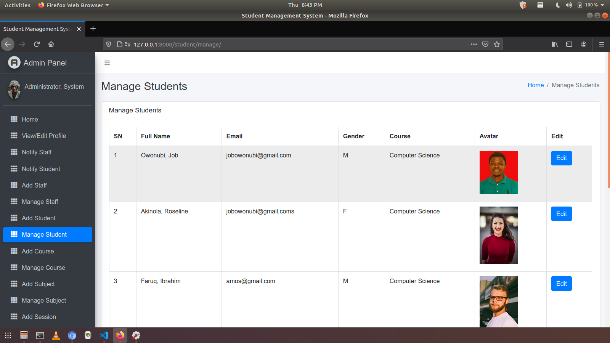
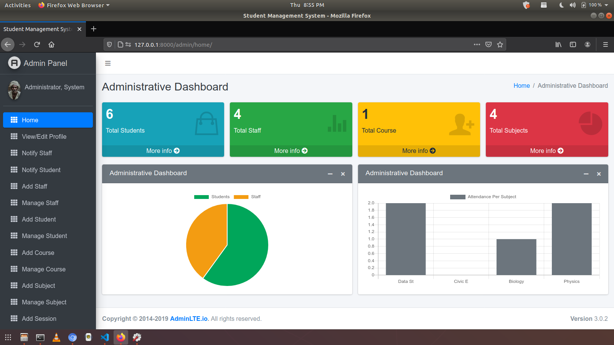

# E-Student Information System
✱ Project:

Developing an E-Student Information System web application for Harambee University which is used as a major software solution that helps with everything from admissions to student success. It facilitates and manages key administrative processes, maintains order and organization within a school's records, and can make universities and colleges more efficient.

Working as: In our Engineering Team I have worked as a Python-Back-End developer for this project.

✱ Responsibilities:

Develop back-end components to improve responsiveness and overall performance.
Creating and maintaining the server-side components of the system.
Integrate user-facing elements into each application.
Test and debug programs.
Implement security and data protection solutions.
Assess and prioritize feature requests.
Coordinate with internal teams to understand user requirements and provide technical solutions.

Styled responsive web design to fit both desktop and mobile views of the browser.


✱ Tools & For What I Used them

Developed the web application in Python Frame-work Python, Django, Mysql, PostgreSQL, Bootstrap, and Vs.code.


I used a python virtual environment to keep dependencies required by different projects separate by creating isolated python virtual environments for them.

I used python Gunicorn to run  Python applications concurrently by running multiple Python processes within a single dyno.

I used psycho-pg for interacting with PostgreSQL from the Python scripting language

I used WhiteNoise for static file serving for the system.

I used the Pillow library for the basic image processing functionality. 

I used requests to send HTTP requests using Python


✱  E-Student information system generally has the following 
    features:
· Offer an easy-to-use interface for any normal user. Since all the application is predefined, details only need to be filled in the required fields of information; multiple screen inputs are avoided for ease of working.
· Designed to support large amounts of data and simultaneous access by a number of users.
· All the required details such as admission information, course, syllabus, account, or fee, which are indexed and classified for easy access.
· Easy-to-decipher reporting functions and analytics for individuals as well as departments, to facilitate the generation of real-time reports and customized reports.
· Flexible to operate in multiple ways with easy-to-change operating or processing setups, in tune with current requirements.
· Easy integration with the other modules that already exist; also offer ingenuity during integration.
· Capability to support all types of requests for approvals, and designed to generate proper notifications for all sanctions; also support all forms of electronic signatures for the validity of documents.
· Easy inputting of information to the system, supporting even batch-type uploads from various sections to keep the system up-to-date with current information; such uploads can be made even by desktop users.
· User preferences allow users to permit the printing of a document or to keep it in electronic format; users also have the facility to update their system preferences, while the system keeps a track of all such changes administered for the records.
· Scalability to allow easy reconfiguring of the system permitting expansion in data sourcing as well as the introduction of more users.
· Can store digital images, videos, and other relevant multimedia content.
· A dependable security system allows only designated users to access all the system capabilities; it offers various levels of security to restrict access to undefined users, and the received information from other sources is subjected to security scans.


✱  The goal of the Project: 
The primary purpose of the Student Information System is to manage, store and track the student's related data in a secure environment. This platform allows the admin to store students' academic records in one place and ensure that only authorized persons can access the information.


✱  Outcome: 
It helps the university to facilitate and manage key administrative processes, maintains order and organization within a school's records, and makes the university and students more efficient.


✱ Project:
This Nibret Kutitir System is a Stock Mmanagement and Inventory Demand Forecastings ystem. it is developed for the popular Ethiopian Electronics wholesales trading company Mimi Computers. And the system incorporates managing the stock  and inventory system as well as forecasting the demand of the market using machine learning.


Position: : In our Engineering Team I have worked as a Python-Back-End developer and Machine learning Engineer for this project.


✱ Responsibilities:

Develop back-end components to improve responsiveness and overall performance.
Creating and maintaining the server-side components of the system.
Integrate user-facing elements into each application.
Test and debug programs.
Implement security and data protection solutions.
Assess and prioritize feature requests.
Coordinate with internal teams to understand user requirements and provide technical solutions.


Styled responsive web design to fit both desktop and mobile views of the browser.


✱ Tools & For Why I Used them

Developed the web application in Python Frame-work Python, Django, Django-rest-framework, Django_q(for asynchronous processes), Mysql, PostgreSQL.

I used Django to build the server side of the system.

I used Django-rest-framework to build the Web API’s to extend the functionality of a web browser and to enable Server API can extend the functionality of a web server.

I used Django_q for database-related operations.
I used Pandas  to load the data frame in a 2D array format and to perform analysis tasks in one go.
I used Numpy arrays to perform large computations in a very short time.
I used Matplotlib/Seaborn to draw visualizations.
I used Sklearn to perform tasks from data preprocessing to model development and evaluation.
I used XGBoost to have the eXtreme Gradient Boosting machine learning algorithm to achieve high accuracy on predictions.


 ✱  Features of Nibret Kutitir System

Inventory Management
Barcoding and Tagging
Inventory Tracking
Reporting Tools
Transfer Management Capabilities
Store Return Handling
Inventory Forecasting
Demand Planning


 ✱  The goal of the Project: 


 Increases productivity and efficiency
Creates a more organised warehouse
Helps save time and money
Improves accuracy of inventory orders
Keeps customers coming back for more


Outcome:

It helps the company to manage its stocks, inventories and to forecast market demand and ensures a business have enough product to fulfill customer orders while not tying up cash in unnecessary inventory. 


## 📸 ScreenShots






| Admin| Staff| Student |
|------|-------|---------|
||||
||||
||||
||||
||||
||||


## How to Install and Run this project?

### Pre-Requisites:
1. Install Git Version Control
[ https://git-scm.com/ ]

2. Install Python Latest Version
[ https://www.python.org/downloads/ ]

3. Install Pip (Package Manager)
[ https://pip.pypa.io/en/stable/installing/ ]

*Alternative to Pip is Homebrew*

### Installation
**1. Create a Folder where you want to save the project**

**2. Create a Virtual Environment and Activate**

Install Virtual Environment First
```
$  pip install virtualenv
```

Create Virtual Environment

For Windows
```
$  python -m venv venv
```
For Mac
```
$  python3 -m venv venv
```
For Linux
```
$  virtualenv .
```

Activate Virtual Environment

For Windows
```
$  source venv/scripts/activate
```

For Mac
```
$  source venv/bin/activate
```

For Linux
```
$  source bin/activate
```

**3. Clone this project**
```
$  git clone (https://github.com/dawitt2327/E-Student-Management-System.git)
```

Then, Enter the project
```
$  cd e-student-managemen-system
```

**4. Install Requirements from 'requirements.txt'**
```python
$  pip3 install -r requirements.txt
```

**5. Add the hosts**

- Got to settings.py file 
- Then, On allowed hosts, Use **[]** as your host. 
```python
ALLOWED_HOSTS = []
```
*Do not use the fault allowed settings in this repo. It has security risk!*


**6. Now Run Server**

Command for PC:
```python
$ python manage.py runserver
```

Command for Mac:
```python
$ python3 manage.py runserver
```

Command for Linux:
```python
$ python3 manage.py runserver
```

**7. Login Credentials**

Create Super User (HOD)
Command for PC:
```
$  python manage.py createsuperuser
```

Command for Mac:
```
$  python3 manage.py createsuperuser
```

Command for Linux:
```
$  python3 manage.py createsuperuser
```


Then Add Email and Password

**or Use Default Credentials**

*For HOD /SuperAdmin*
Email: admin@admin.com
Password: admin

*For Staff*
Email: staff@staff.com
Password: staff

*For Student*
Email: student@student.com
Password: student


## For Sponsor or Projects Enquiry
1. Email - dawitt2327@gmail.com
2. LinkedIn - [jobic10](https://www.linkedin.com/in/dawit-tadesse-a01646236/)


## Project's Journey
- [x] Admin/Staff/Student Login
- [x] Add and Edit Course
- [x] Add and Edit Staff
- [x] Add and Edit Student
- [x] Add and Edit Subject
- [x] Upload Staff's Picture
- [x] Upload Student's Picture
- [x] Sidebar Active Status
- [x] Named URLs
- [x] Model Forms for adding  student
- [x] Model Forms for all
- [x] Views Permission (MiddleWareMixin)
- [x] Attendance and Update Attendance
- [x] Password Reset Via Email
- [x] Apply For Leave
- [x] Students Can Check Attendance
- [x] Check Email Availability
- [x] Reply to Leave Applications
- [x] Reply to Feedback
- [x] Admin View Attendance
- [x] Password Change for Admin, Staff and Students using *set_password()*
- [x] Admin Profile Edit
- [x] Staff Profile Edit
- [x] Student Profile Edit
- [x] Student Dashboard Fixed
- [x] Passing Page Title From View  - Improved
- [x] Staff Dashboard Fixed
- [x] Admin Dashboard Fixed
- [x] Firebase Web Push Notifications
- [x] Staff Add Student's Result
- [x] Staff Edit Result Using CBVs (Class Based Views)
- [x] Google CAPTCHA
- [x] Student View Result
- [x] Change all links to be dynamic
- [x] Code Restructure - Very Important


## Helpful Links
- https://stackoverflow.com/questions/55969952/how-can-i-avoid-a-user-from-registering-an-already-used-email-in-django
- https://stackoverflow.com/questions/7562573/how-do-i-get-django-forms-to-show-the-html-required-attribute
- https://stackoverflow.com/questions/40910149/django-exists-versus-doesnotexist
- https://www.edureka.co/community/80982/how-can-i-have-multiple-models-in-a-single-django-modelform
- https://stackoverflow.com/questions/12848605/django-modelform-what-is-savecommit-false-used-for
- https://simpleisbetterthancomplex.com/tutorial/2018/01/18/how-to-implement-multiple-user-types-with-django.html
- https://stackoverflow.com/questions/32576348/how-can-i-create-django-modelform-for-an-abstract-model
- https://www.fomfus.com/articles/how-to-use-email-as-username-for-django-authentication-removing-the-username
- https://stackoverflow.com/questions/64145745/create-user-missing-1-required-positional-argument-username?noredirect=1#64145844
- https://stackoverflow.com/questions/36059194/what-is-the-difference-between-json-dump-and-json-dumps-in-python
- https://stackoverflow.com/questions/64188313/django-can-i-delete-apps-static-files-after-running-collectstatic/64189244#64189244
- https://stackoverflow.com/questions/29416478/change-form-field-value-before-saving
- https://support.google.com/mail/thread/38519529?hl=en
- https://stackoverflow.com/questions/46155/how-to-validate-an-email-address-in-javascript
- https://stackoverflow.com/questions/3429084/why-do-i-get-an-object-is-not-iterable-error
